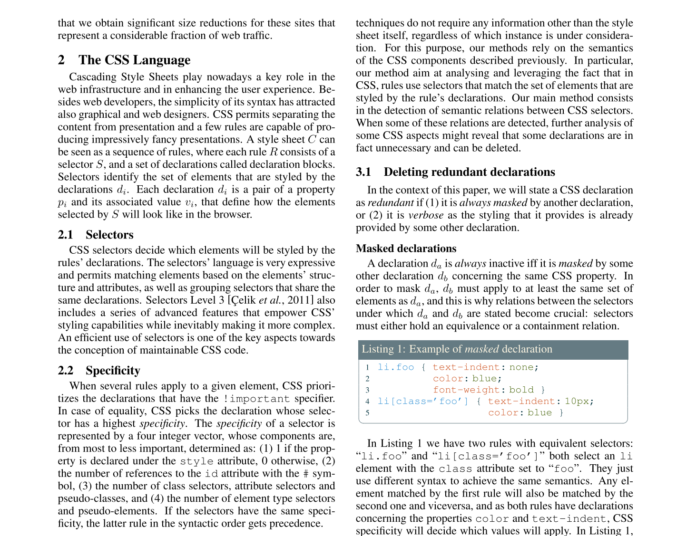

# HTML と CSS の基礎

Mozilla Japan 清水智公

<nshimizu@mozilla-japan.org> / [@chikoski](https://twitter.com/chikoski)

---

## 目的

* HTML と CSS の役割について学ぶ
* 内容
    * HTML の文法
    * CSS の文法、セレクタ、ボックスモデル

---

## よくあるディレクトリレイアウト

~~~sh
.
├── images
├── index.html
├── scripts
└── styles
~~~

* index.html: トップページ
* images：画像を保存するフォルダ
* scripts：JavaScript ファイルを保存するフォルダ
* styles：CSS ファイルを保存するフォルダ

---

## 練習問題 1

* opw-day1 に次のフォルダを追加するプルリクエストを作成してください
* 追加するフォルダ
    * imagews
    * scripts
    * styles
* それぞれのフォルダには .gitkeep というファイルを追加してください

---

## 論文：Web ページの基本モデル

Bosch, Martí; Genevès, Pierre; Layaïda, N. (2015). Reasoning with Style. In Proceedings of the Twenty-Fourth International Joint Conference on Artificial Intelligence (IJCAI 2015) (pp. 2227–2233).

---

## HTML: Hyper Text Markup Language

~~~html
私の猫はとっても気難しい

私の猫はとっても気難しい

~~~

* プログラミング言語ではなく、マークアップ言語
* マークアップ：データのある範囲の意味を明確にすること

----

### HTML 要素

[Getting started with HTML](https://developer.mozilla.org/Learn/HTML/Introduction_to_HTML/Getting_started) より

----

### 入れ子になった要素

~~~html

私の猫はとっても気難しい

私の猫は<strong>とっても</strong>気難しい

~~~

* 要素の間に、別の要素を入れることができます
* このような状態を「入れ子」もしくは「ネスト」と呼びます

----

### 空要素

~~~html

~~~

* 閉じタグのない要素のことです
* 代表例：img タグ

----

### 属性

* HTML 要素は 0 個以上の属性を持てます
* 持てる属性はタグによって異なります

----

### 属性の書式

* 開始タグの中に記述する
* 要素名との間に 1 つ以上のスペースを入れること
* 属性名を書き、続けて = を書くこと
* 属性値は " と " に挟まれていること
* 複数の属性を記述するときは、前の属性との間に 1 つ以上のスペースを入れること

----

### 実体参照

|文字|実体参照|
|---|-------|
|<|&amp;lt;|
|>|&amp;gt;|
|"|&amp;quot;|
|'|&amp;apos;|
|&|&amp;amp;|

* 上記の文字は文法特別な意味を持つので、直接記述できません
* その代わりに、実体参照と呼ばれる記法で間接的に記述します

----

### 基本的な HTML の形

~~~html
<!doctype html>
<html>
  <head>
    <meta charset="utf-8">
    <title>私の猫</title>
  </head>
  <body>
    
    
私の猫は<strong>とっても</strong>気難しい

  </body>
</html>
~~~

---

## 練習問題 2

* opw-day1 に index.html を追加するプルリクエストを作成してください
* index.html には、[HTML で使用できるタグ](https://developer.mozilla.org/docs/Web/HTML/Element)を 10 個調査し、その意味と、使用例をまとめてください

---

## CSS：Cascading Style Sheets

* 文書の表示方法を規定する言語です
* 文書：HTML や XML、SVG のようなマークアップ文書のことを指します
* 表示：データをユーザにわかるように提示することです
     * 表示例：画面への描画、音声での読み上げ、印刷、etc
     * 2 次元の画像を作ることだけが表示ではありません

----

### HTML との連携

----

### link 要素による CSS とのリンク

~~~html
<!doctype html>
<html>
  <head>
    <meta charset="utf-8">
    <title>私の猫</title>
    <link rel="stylesheet" href="styles/mycat.css">
  </head>
  <body>
    <h1>私の猫</h1>
    
    
私の猫は<strong>とっても</strong>気難しい

  </body>
</html>
~~~

----

### CSS の例

~~~css
h1{
  color: white;
  background-color: gray;
  font-size: 200%;
  border: 1px solid black;
}

p{
  color: blue;
}
~~~

----

### CSS 宣言

~~~css
background-color: gray
~~~

* 属性と属性値のペアです
* 属性と属性値を : で区切ります
* この宣言に基づいてスタイリングが行われます

----

### CSS 宣言ブロック

~~~css
{
  color: white;
  background-color: gray;
}
~~~

* グループ化された宣言のことです
* { と } で宣言を囲ってグループ化します
* 複数の宣言がある場合は、宣言と宣言の間に ; を記述します
* 最後の宣言の末尾に ; をつける必要はありませんが、つけても良いです

----

### セレクタ

~~~css
h1{
  color: white;
  background-color: gray;
}
~~~

* [セレクタ](https://developer.mozilla.org/ja/docs/Web/Guide/CSS/Getting_started/Selectors)：CSS 宣言ブロックを適用する先の指定
* 基本的なものは以下の通りです
     * タグセレクタ：マッチするタグ名を記述する
     * クラスセレクタ：マッチするクラス属性の値を記述する
     * ID セレクタ：マッチするid 属性の値を記述する

----

### タグセレクタ：タグ名にマッチ

~~~ css
h1{
  color: white;
  background-color: gray;
}
~~~

~~~ html
<h1>ここには適用されます</h1>

ここには適用されません

~~~

----

### 属性セレクタ：class 属性の値にマッチ

~~~css
.note{
    font-size: 80%;
}
~~~

~~~html
<h1>ここには適用されません</h1>
<h2 class="note">ここには適用されます</h1>
<h2 class="another-value">ここには適用されません</h1>

ここには適用されません

ここには適用されます

~~~

----

### ID セレクタ：id 属性の値ににマッチ

~~~css
#title{
  color: red;
}
~~~

~~~html
<h1>ここには適用されません</h1>

ここには適用されません

ここには適用されます

ここには適用されません

~~~

---

## 練習問題 3

* CSS 属性を 10 個調査し、その解説を index.html に追加してください
* 効果がわかるデモも追加してください
* 上記を行ったら、プルリクエストを作成してください

---

## ボックスモデル

[Box model](https://developer.mozilla.org/docs/Web/CSS/Box_model) より引用

----

### ブロックレベル要素とインライン要素

* display 属性の値によってボックスの配置方法が異なる
* 値
     * block：新しい行を開始する
     * inline：行内に配置される
* 既定値が要素ごとに異なる

---

## まとめ

* HTML と CSS の役割分担
    * HTML：文書の意味を定義する言語
    * CSS：文書の表示方法を規定する言語
* 要素、ネスト
* セレクタ、CSS 宣言
