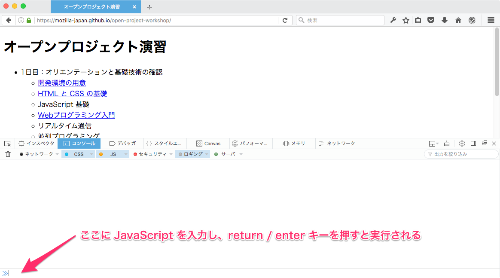
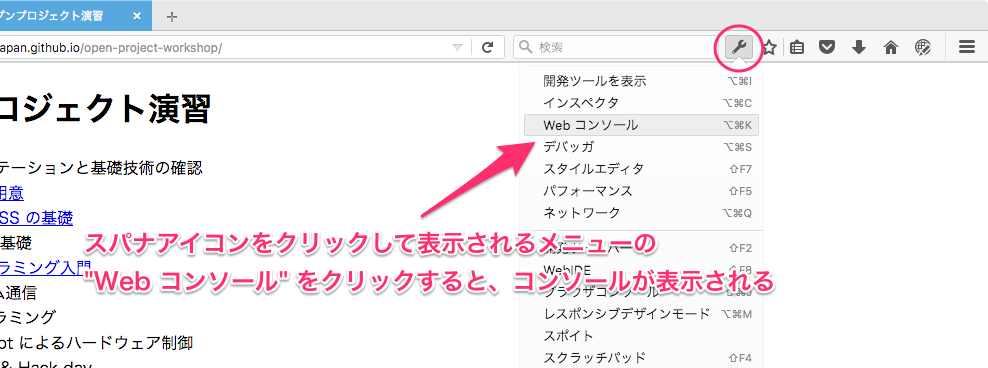
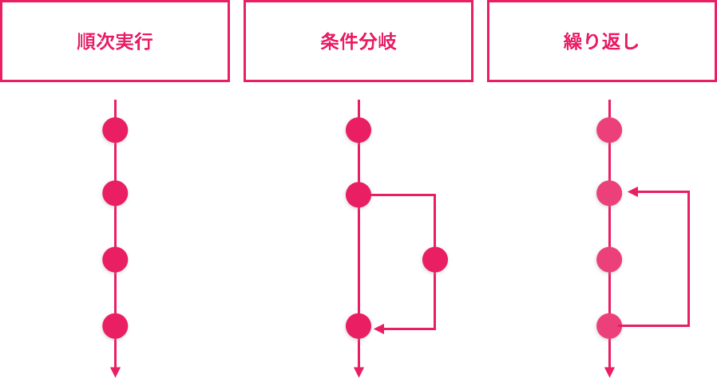

# JavaScript 基礎

Mozilla Japan 清水智公

<nshimizu@mozilla-japan.org> / [@chikoski](https://twitter.com/chikoski)

---

## 目的

* JavaScript の基礎文法の確認
* 内容
     * 値の種類と変数
     * 制御構造
     * 関数とクロージャ
     * ユーザ定義型

---

## Web コンソールでの対話的な実行



----

### Web コンソールの表示方法



---

## 式と評価

~~~javascript
1 + 1 // 評価すると 2 になる
"hello, " + "world" // 評価すると "hello, world" になる
1 < 2 // 評価すると false になる
~~~

* 評価：計算して値をきめること
* 式：評価して値が決まるもの

---

## 値の種類

| 値の種類 | 解説 | 記述例 |
|------|----|-----|
| 数値 | 実数値 | 1 |
| 真偽値 | true もしくは false のどちらか | true |
| 文字列 | 0 文字以上の文字 | "hello, world" |
| 配列 | 0 個以上の値の列 | [1, true, "hello", "world"] |
| オブジェクト | 属性と属性値のペアの集まり | { name: "John", age: 10, married: false} |
| 関数 | 処理の集まり | function(value){return value;} |

---

## 数値

~~~javascript
1
-1
3.14159265
~~~

* 32 bit の倍精度浮動小数です
* 整数、実数の区別はありません
* 符合つきです

----

### 算術演算：数値×数値→数値

|演算子|役割|例|評価値|
|----|---|--|----|
|+|二つの値の足し算|3.14+1|4.14|
|-|二つの値の引き算|3.14-1|2.14|
|*|二つの値の掛け算|3.14*2|6.28|
|/|二つの値の割り算|3.14/2|1.57|
|%|二つの値の割り算の、あまり|10%3|1|

----

### 比較演算：数値×数値→真偽値

|演算子|意味|利用例|評価値|
|-----|---|----|------|
|==|右辺と左辺が等しい|1 == 10|false|
|!=|右辺と左辺が等しくない|1 != 10|true|
|>|左辺が右辺より大きい|1 > 10|false|
|<|左辺が右辺より小さい|1 < 10|true|
|>=|左辺が右辺以上である|1 >= 10|false|
|<=|左辺が右辺以下である|1 <= 10|true|

---

## 真偽値

~~~javascript
true
false
~~~

* 真 (true) か偽 (false) を表すデータの種類です
* とりうる値は true もしくは false のどちらかです
* 論理演算子を用いて、演算します

----

### 論理演算：真偽値×真偽値→真偽値

|演算子|意味|利用例|評価値|
|-----|---|----|------|
|&amp;&amp;|右辺と左辺の評価値がともに true（かつ）|true &amp;&amp; false | false|
|&#124;&#124;|右辺と左辺の評価値のどちらかが true（または）|true &amp;&amp; false |true|

----

### 評価値のパターン：&amp;&amp;

|式|Aの評価値|Bの評価値|式の評価値|
|--|-------|--------|--------|
|A&amp;&amp;B|true|true|true|
|A&amp;&amp;B|false|true|false|
|A&amp;&amp;B|true|false|false|
|A&amp;&amp;B|false|false|false|

* 両辺の評価値が true のときのみ、評価値は true となります
* それ以外の場合、評価値は false となります

----

### 評価値のパターン：&#124;&#124;

|式|Aの評価値|Bの評価値|式の評価値|
|--|-------|--------|--------|
|A&#124;&#124;B|true|true|true|
|A&#124;&#124;B|false|true|true|
|A&#124;&#124;B|true|false|true|
|A&#124;&#124;B|false|false|false|

* 両辺の評価値が false の場合、評価値は false となります
* それ以外の場合、評価値は true となります

----

### 論理演算：真偽値→真偽値

|演算子|意味|利用例|評価値|
|-----|---|----|------|
|!|続く式の評価値を否定する|!true|false|

----

### 比較演算：真偽値×真偽値→真偽値

|演算子|意味|利用例|評価値|
|-----|---|----|------|
|==|右辺と左辺が等しい|true == false|false|
|==|右辺と左辺が等しくない|true != true|false|

---

## 文字列

~~~javascript
"hello, world"
'hello, JavaScript'
~~~

* 0 文字以上の文字の列です
* " もしくは ' で囲んだものは文字列となります

----

### \+ 演算：文字列×文字列→文字列

~~~javascript
"hello, " + "world"
~~~

* \+ で文字列同士を結合できます
* 新しい文字列が作成されます
* つまり元の文字列はそのまま保持されます（非破壊的）

----

### 比較演算：文字列×文字列→真偽値

|演算子|意味|利用例|評価値|
|-----|---|----|------|
|==|右辺と左辺が等しい|"A" == "a"|false|
|!=|右辺と左辺が等しくない|"A"!= 'a'|true|
|>|左辺が右辺より大きい|"B" > "A"|false|
|<|左辺が右辺より小さい|"B" < "A"|true|
|>=|左辺が右辺以上である|"B" >= "A"|false|
|<=|左辺が右辺以下である|"B" <= "A"|true|

* 大小の比較は時書式に行われます
* 漢字が混じる文字の比較には注意が必要です

---

## 演算子の優先度と結合性

~~~javascript
1 + 2 + 3 * 4
1 + 3 * (1 + 2) == 11
1 < 2 == 3 > 4 && "a" != "b" || true
~~~

* [演算子には優先度がある](https://developer.mozilla.org/docs/Web/JavaScript/Reference/Operators/Operator_Precedence)
* 優先度の高いほうが先に評価されます
* 優先度が同じ場合は、結合性にしたがって評価されます
     * 右結合：右側の式が優先されること
     * 左結合：左側の式が優先されること

---

## 変数

~~~ javascript
let a, b, c;
a = 1;
b = 2;
c = a + b;
~~~

* 変数：値につけられた名前のこと。値は計算の途中で明らかになる
* 宣言：変数として利用する名前を決めること
* 代入：名前と値とを結びつけること
* 参照：変数を代入された値に置き換えること

----

### 宣言

~~~ javascript
let a, b, c;
let message;
let firstName, surname;
~~~

* let 文で変数名を宣言します
* , で区切って複数の変数を宣言できます

----

### 代入

~~~ javascript
let a, b, c;
a = 10;
c = b = 1;
~~~

* 代入演算子 = を使って、値と名前とを結びつけます
* = の評価値は、代入された値となります

----

### 参照

~~~ javascript
let firstName, surName;
let name;
surName = "清水";
fisrtName = "智公";

name = surname + firstName;
~~~

* 式の中に変数名を書くと、実行時には変数名が評価されて、値に変わります
* この評価を参照と呼びます

---

## 制御構造



---

## if 文：条件分岐の記述

~~~javascript
if(condition){
// condition が true の時に何かする
}
~~~

* ある場合のときだけ行う特別な処理の書き方です
* () 内の式の評価値が true の時のみ {} を実行します

----

#### if-else 文

~~~javascript
if(condition){
// A: condition が true の時に何かする
}else{
// B: それ以外の場合にやる処理
}
~~~

* 排他的な処理の記述方法です
* () 内の式の評価値が true の時 A を、それ以外の場合は B を実行します

----

#### if-else if-else

~~~javascript
if(condition_1){
// A：condition_1 が true の時に何かをする
}else if(condition_2){
// B：condition_1 が false の時に、condition_2 が評価され、
//    それが true の時に実行される
}else{
// C：condition_1 も condition_2 も false の時に実行される
}
~~~

---

## while 文：繰り返しの実現

~~~javascript
while(condition){
// 繰り返す処理
}
~~~

* 繰り返しの実現方法です
* condition の評価値が true の間 {} 内を繰り返します

---

## 関数

~~~javascript
function id(value){
  return value;
}

let a, b;
a = 1;
b = id(a);
~~~

* 複数の文をまとめて名前をつけたもです
* 定義：関数を作ること
* 呼び出すことで、まとめた処理を実行できます

---

## 関数呼び出し

~~~javascript
alert("hello, world");
~~~

* 定義されてる関数を利用することです
* 呼び出す際は ```関数名(引数リスト)``` と記述します
* () は関数呼び出しを行う演算子です

----

### 引数

~~~javascript
alert("hello, world");
alert("こんにちは！こんにちは！");
~~~

* 関数に与える入力です
* 入力によって関数は違う振る舞いをします
* 引数の個数は関数によって異なります
* 複数の引数を与える場合は、引数を , で区切って列挙します

---

## 関数定義

~~~javascript
function id(value){
  return value;
}
~~~

* 定義：仕事をまとめて名前をつけること
* function 文を利用します

----

### 関数を定義するためには

* まとめる仕事を決めましょう
* 名前を決めましょう
* 引数をきめましょう
* 返り値を決めましょう

----

### 返り値

~~~javascript
function id(value){
  return value;
}

let a;
a = id(5); // 5 が代入される
~~~

* 関数の評価値です
* return 文で返す値を決めます
* return 文が省略された場合は、undefined が返ります

----

### function 式

~~~javascript
function(value){
  return value;
};

let id = function(value){
  return value;
};
let a = id;

id(1); // 1
a(1);  // 1
~~~

* function 式を使うと、名前のない関数を作れます
* 関数は変数へ代入できます
* 変数に代入されても、その関数は呼び出せます

---

## 練習問題 1：FizzBuzz

* FizzBuzz と呼ばれる働きをする関数を定義してください
* 仕様：数値→文字列
    * 引数に指定された正の整数を、文字列に直したものを返します
    * ただし、その数が 3 の倍数の時は "Fizz" を返します
    * ただし、その数が 5 の倍数の時は "Buzz" を返します
    * ただし、その数が 3 の倍数で、しかも 5 の倍数の時は "FizzBuzz" を返します
* 関数名は fizzbuzz としてください

---

## 練習問題 2：フィボナッチ数列

* フィボナッチ数列を計算する関数 fib を定義してください
* fib(35) を計算させてみてください

---

## 練習問題 3：ズンドコキヨシ

* ランダムに "ズン" もしくは "ドコ" を返す関数を定義してください
* その関数を繰り返し呼び続ける関数を定義してください
    * ただし、直近の結果が "ズン" "ズン" "ズン" "ズン" "ズン" "ドコ"　だった場合、
      "キヨシ！" と出力して、呼び出しを終了してください
    * 出力には console.log を利用してください
* ランダムな数の生成には Math.random() を利用してください

---

## 変数のスコープ

~~~javascript
let value = 1;

function id(n){
  let value = n + 1;
  console.log(value);
  {
    let value = 0
    console.log(value);
  }
  return value;
}
console.log(value);
let ret = id(value);
~~~

----

### スコープ：名前の有効範囲

* 有効範囲は宣言位置と方法によって異なります
    * var：関数スコープ
    * let：ブロックスコープ
* 同じ名前の変数があった場合、より狭いスコープのものが優先されます

---

## const：再代入できない let

~~~javascript
let a = 1;
a = a + 1; // ok
const b = 1;
b = b + 1; // error
~~~

* const で宣言された変数への代入は 1 度までです
* それ以上の代入はエラーとなります
* ブロックスコープです

---

## オブジェクト：表

~~~ javascript
var chiko = {
  surname: "清水",
  firstName: "智公"
};
var name = chiko.surname + chiko.firstName;
~~~

* ```属性:属性値``` の集まりです
* {} 中に属性と属性値を , で区切って列挙します
* 属性の参照は ```変数名.属性名``` と . で行います

----

### メソッド：属性値になった関数

~~~ javascript
var chiko = {
  surname: "清水",
  firstName: "智公",
  name: function(){
    return this.surname + this.firstName;
  }
};
var name = chiko.name();
~~~

* 関数もオブジェクトの属性値にできます
* オブジェクトの属性値になった関数のことをメソッドと呼びます
* メソッド中で、オブジェクト自身を参照する時は、this を利用します

---

## 配列

~~~ javascript
let a = [1, 2, 3];
let i = 0;
let sum = 0;
while(i < a.length){
  sum = sum + a[i];
}
~~~

* 複数の値の列です。一つ一つの値のことを要素と呼びます。
* 長さ：要素の数のこと。length 属性で参照できます
* それぞれの要素は[]の中に添字を書くことで参照できます

----

### for 文を使った走査

~~~ javascript
let a = [1, 2, 3];
let sum = 0;
for(let i of a){
    sum = sum + i;
}
~~~

* for 文を使うことで、走査が簡単になります
* 走査：配列中の値を先頭から末尾まで取得して行う作業のことです

----

### reduce：畳み込み

~~~ javascript
let a = [1, 2, 3];
let sum = a.reduce(function(accumlator, value){
  return accumulator + value;
});
~~~

* reduce メソッドを利用することで、左畳み込みができます
* 引数には畳み込みを行う際の処理を実装した関数を指定します

----

### map：写像

~~~ javascript
let a = [1, 2, 3];
let newValues = a.map(function(i){
  return i * 13 % 17;
});
~~~

* map 関数は、配列のすべての要素に対して関数を適用した結果得られる新しい配列を返します
* 引数はそれぞの要素に対して適用する関数です

---

## アロー関数

~~~ javascript
function add(a, b){
  return a, b;
}
let anotherAdd = (a, b) => {
  return a + b;
};
~~~

* 無名の関数を定義する 2 つ目の方法です
* this の束縛方式が、function 文 / 式とは異なります
     * function：ダイナミックバインディング
     * アロー関数：レキシカルバインディング

----

### 引数が 1 つのアロー関数

~~~ javascript
let id = (value) => {
  return value;
};

let anotherID = value => {
  return value;
};
~~~

* 引数が 1 つの場合、引数リストの () は省略できます

----

### 関数本体が 1 つの式の場合のアロー関数

~~~ javascript
let id = value => {
  return value;
};

let anotherID = value => value;
~~~

* 関数本体（{} の中身）が 1 つの式の場合、{} を省略できます

---

## オブジェクトを返す関数

~~~ javascript
function person(surname, firstName){
   return {
     surname: surname,
     firstName: firstName
   };
}

let chiko = person("清水", "智公");
~~~

* オブジェクトも値なので、返り値にできる

----

### コンストラクタ関数と new 演算子

~~~javascript
function person(firstName, surname){
   this.firstName = firstName;
   this.surname = surname;
}

let chiko = new person("清水", "智公");
~~~

* コンストラクタ：オブジェクトを定義する関数
* new 演算子を使って、新しいオブジェクトを作ります

----

### メソッドの追加方法その 1：コンストラクタで追加する

~~~ javascript
function person(firstName, surname){
   this.firstName = firstName;
   this.surname = surname;

   this.name = function(){
     return this.surname + this.fistName;
   };
}

let chiko = new person("清水", "智公");
~~~

----

### メソッドの追加方法その 2:プロトタイプへの追加

~~~ javascript
function person(firstName, surname){
   this.firstName = firstName;
   this.surname = surname;
}
person.prototype.name =  function(){
     return this.surname + this.fistName;
};
~~~

----

### メソッドの追加方法その 3：プロトタイプの上書き

~~~ javascript
function person(firstName, surname){
   this.firstName = firstName;
   this.surname = surname;
}
person.prototype = {
   name: function(){
     return this.surname + this.fistName;
   }
};
~~~

---

## 関数を返す関数

~~~javascript
function addFunction(){
   return (a, b) => a + b;
}

let add = addFunction();
add(1, 2);
~~~

* 関数も値なので、返り値にできます

----

### クロージャ：定義時の環境の保存

~~~javascript
function addFunction(value){
   return a => a + value;
}

let addOne = addFunction(1);
let addTwo = addFunction(2);
addOne(1); // 2
addTwo(1); // 3
~~~

* 関数を定義する時に、そのスコープの変数を参照できます
* その時の値が関数内部で使えます

---

## まとめ

* JavaScript の基本を見ました
* コンストラクタ、クロージャはよく使うテクニックなので覚えておきましょう
