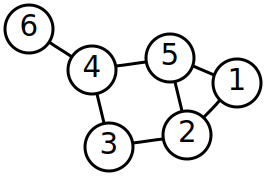

# Web プログラミング入門

Mozilla Japan 清水智公

<nshimizu@mozilla-japan.org> / [@chikoski](https://twitter.com/chikoski)

---

## 目的

* JavaScript で Web ブラウザの提供する機能を利用すること
* DOM (Document Object Model) 操作
* Web API (Application Programming Interface)

---

## 背景：グラフ

[WikiPedia:グラフ理論より引用](https://ja.wikipedia.org/wiki/%E3%82%B0%E3%83%A9%E3%83%95%E7%90%86%E8%AB%96)

* [グラフ理論](https://ja.wikipedia.org/wiki/%E3%82%B0%E3%83%A9%E3%83%95%E7%90%86%E8%AB%96)：ものとものとの関係を扱うための数学のジャンル
* ノード：ものや対象
* エッジ：関係
* グラフ：ノードとエッジの集まり

----

### 背景：木構造

[WiKiPedia:木_(数学)](https://ja.wikipedia.org/wiki/%E6%9C%A8_(%E6%95%B0%E5%AD%A6) から引用

* グラフの 1 種類
* 全てのノードがエッジでつながっていて、しかも [サイクル](https://ja.wikipedia.org/wiki/%E9%96%89%E8%B7%AF)がない
* 一番上のノードのことを根 (root) と呼びます

---

## HTML は木構造をした文書

---

## script 要素

~~~html

~~~

* script 要素で、そのページで動作させる JS ファイルを指定します
* body の閉じタグ前に書いておくと、問題が少なくなります

---

## document オブジェクト

* 表示中の HTML 文書を表すオブジェクト
* children 属性から、文書中の要素をたどれます（[デモ](dom-tree-traversal))
* c.f.[インタフェースの解説](https://developer.mozilla.org/ja/docs/Web/API/document)

---

## 任意のノードの検索

* 戦略 1：children 属性を再帰的に操作し、自分で探す
* 戦略 2：document の持つ検索用のメソッドを利用する

----

### document.querySelector()

~~~ javascript
let item = document.querySelector("li");
let title = document.querySelector("#title");
~~~

* セレクタにマッチするノードを検索できます
* マッチするノードが複数あった場合は、最初にマッチするものを返します
* c.f [document.querySelector](https://developer.mozilla.org/ja/docs/Web/API/Document/querySelector)

----

### document.getElementById()

~~~ javascript
let title1 = document.querySelector("#title");
let title2 = document.getElementById("title");
~~~

* この二つは同じ要素を検索できます
* このメソッドを利用すると、ID 属性の値をキーに検索できます
* c.f. [document.getElementById](https://developer.mozilla.org/ja/docs/Web/API/Document/getElementById)

---

## ノードに対する操作

* 全てのノードに対して行える操作 (c.f. [HTMLElement](https://developer.mozilla.org/ja/docs/Web/API/HTMLElement))
    * 子ノードの追加や削除 (appendChild /removeChild)
    * 子孫ノードの検索（querySelector / getElementById, etc)
* ノードの種類に応じてできる固有の操作
    * [HTMLMediaElement](https://developer.mozilla.org/ja/docs/Web/API/HTMLMediaElement)：再生、一時停止、ボリュームの調整,etc
    * [HTMLCanvasElement](https://developer.mozilla.org/ja/docs/Web/API/HTMLCanvasElement)：描画コンテキスト取得,etc

----

### ノードの持つ属性へのアクセス

~~~ javascript
let p = document.querySeletor("p");
console.log(p.textContent);
p.textContent = "Hello, world!";

let textarea = document.querySelector("textarea");
console.log(textarea.value);
textarea.value = "こんにちは！せかい";
~~~

----

### 子ノードの追加

~~~javascript
let list = document.querySelector("ul");
let newItem = document.createElement("li");
newItem.textContent = "新しい要素";
list.appendChild(newItem);
~~~

* [document.createElement](https://developer.mozilla.org/ja/docs/Web/API/Document/createElement)：新しい要素の作成
* appendChild：子要素の追加

----

### 子要素の削除

~~~javascript
let list = document.querySelector("ul");
let newItem = document.createElement("li");
newItem.textContent = "新しい要素";
list.appendChild(newItem);
list.removeChild(newItem);
~~~

* removeChild: 指定した要素を子要素から削除

---

## イベント

* ある時刻に起きた「出来事」
* e.g.
    * マウスのクリック
    * キーのタイプ
    * データの読み込み終了
    * タイマーの起動
* イベントはタイムスタンプがついたオブジェクトとして表現されます

---

## イベントハンドリング

* イベントはいつ起きるか本質的に予測できません
* イベントの発生源に対して、ある種類のイベントが発生した時に、特定の処理を行うように設定することで、
  イベントを処理します
     * イベントハンドリング：イベントを処理すること
     * イベントハンドラ：イベントを処理する手続きのこと
* JavaScript では関数でイベントハンドラを実装し、
  その関数をイベントが発生するオブジェクトの addEventHandler メソッドを呼ぶことで、
  イベントをハンドリングさせます

----

### イベントハンドラの設定例

~~~javascript
function handler(event){
  console.log(event.type + "イベントが発生！" + Date(event.timeStamp));
}

let li = document.querySelector("li");
li.addEventListener("click", handler);
~~~

* 最初の li 要素で発生するクリックイベントを処理しています
* addEventListener
    * 第 1 引数：イベントの種類を表す文字列
    * 第 2 引数：ハンドラ

---

## コールバック関数

~~~ javascript
function after(){
  console.log("1秒経ちました");
}

setTimeout(after, 1000);
~~~

* 上記のコードは 1 秒後に「1秒経ちました」とコンソールへ出力します
* この setTimeout は 1 秒後まで仕事が終わりません
* そこで実行をブロックすると、ブラウザ全体が停止してしまうので、
  関数呼び出し自体は終了し、実際の仕事はコールバック関数にさせるという戦略をとっています

----

### コールバック地獄

~~~javascript
setTimeout(() => {
  console.log("1秒経ちました");
  setTimeout(() => {
    console.log("さらに1秒経ちました");
    setTimeout(() => {
      console.log("また1秒経ちました");
    }, 1000)
  }, 1000)
}, 1000);
~~~

* 依存関係のある処理を記述すると、上記のようにコールバック関数の中でまたコールバック関数を書く、といった形になり、
  プログラムの見通しが悪くなってしまいます。

----

### Promise：必ず処理されるという約束

~~~ javascript
function wait1sec(){
   return new Promise((resolve, reject) => {
      setTimeout(resolve, 1000);
   });
}

wait1sec().then(() => {
  console.log("1秒経ちました");
}).catch(error => {
  console.log("何か悪いことが起きました");
});
~~~

----

### Promise オブジェクト

* [Promise](https://developer.mozilla.org/docs/Web/JavaScript/Reference/Global_Objects/Promise) は if 文と近い機能を提供し、3 つの状態を持っています
    * pending：初期状態、成功も失敗もしていない状態
    * fullfilled：処理が成功して完了したことを表す状態
    * rejected：処理が失敗したことを表す状態
* コンストラクタで指定された関数中の処理を行い、状態を遷移します
* 状態変化時に呼ばれるハンドラは then メソッドで設定します

----

### Promise を使った順次実行

~~~ javascript
wait1sec().then(() => {
  console.log("1秒経ちました");
  return wait1sec();
}).then(() =>{
  console.log("さらに1秒経ちました");
  return wait1sec();
}).then(() =>{
  console.log("また1秒経ちました");
});
~~~

* 時間のかかる処理の定義とハンドラの定義を分けて記述できます
* [凝集度](https://ja.wikipedia.org/wiki/%E5%87%9D%E9%9B%86%E5%BA%A6)が上がって見通しがよくなります

----

### Promise.all：全ての処理が成功するかどうか

~~~ javascript
let promises = [1, 2, 3, 4].map(i => doSomething(i));

Promise.all(promises).then(() => {
  console.log("全てうまくいきました！");
}).catch(error => {
  console.log("何かがうまくいきませんでした！");
});
~~~

* Promise はオブジェクトなので、配列の要素にできます
* 配列中の全ての Promise オブジェクトの状態が fullfilled になった時に初めてハンドラを呼び出すような場合は、
  Promise.all を利用します
* Promise.all は、Promise オブジェクトを返します。

---

## ネットワーク通信

* 異なるコンピュータで動いているプログラムとの通信できます
* 手段
    * HTTPによる通信：fetch / XMLHTTPRequest (XHR)
    * ソケットによる双方向通信：WebSocket
    * データグラムによる P2P 通信：WebRTC

----

### fetch

~~~javascript
let toBlob = response => response.blob();
let toURL = blob => URL.createObjectURL(blob);

fetch("foxkeh.png")
    .then(toBlobl).then(toURL).then(url => {
  let image = document.createElement("img");
  image.src = url;
  document.querySelector("body").appendChild(img);
});
~~~

* 指定されたリソースを取得する関数です
* Promise オブジェクトを返します
* fullfilled 時のコールバック関数には [Response](https://developer.mozilla.org/ja/docs/Web/API/Response) オブジェクトが引数として与えられます
* c.f. [GlobalFetch.fetch()](https://developer.mozilla.org/ja/docs/Web/API/GlobalFetch/fetch)

----

### fetch() で JSON を取得する例

~~~ javascript
fetch("some.json").then(response => {
  return response.json();
}).then(data => {
 doSomething(data);
});
~~~

* [Response オブジェクトの json メソッド](https://developer.mozilla.org/ja/docs/Web/API/Body/json)を呼ぶと、JSON データが解決される Promise オブジェクトが返ります

----

### 通信に成功したかどうかの判断

~~~ javascript
fetch("some.json").then(response => {
  if(response.ok){
     console.log("成功：" + response.status);
  }else{
     console.log("失敗：" + response.status);
  }
})
~~~

* [ok 属性](https://developer.mozilla.org/ja/docs/Web/API/Response/ok)
* [status 属性](https://developer.mozilla.org/ja/docs/Web/API/Response/status)

----

### 通信に成功したかどうかの判断（その2）

~~~ javascript
fetch("some.json").then(response => {
  if(response.ok){
    return response;
  }
  Promise.reject(response.statusText);
}).then(response => {
  doSomething(response)
).catch(statusText => {
  console.log(statusText);
})
~~~

* [Promise.reject](https://developer.mozilla.org/ja/docs/Web/JavaScript/Reference/Global_Objects/Promise/reject) は rejected 状態の Promise オブジェクトを返します
* これと [catch メソッド](https://developer.mozilla.org/ja/docs/Web/JavaScript/Reference/Global_Objects/Promise/catch)を利用したエラーハンドリングは上記のように記述できます
* c.f. [CORS](https://developer.mozilla.org/ja/docs/Web/HTTP/HTTP_access_control)

---

## まとめ

* ブラウザの提供する API を利用して、ブラウザの持つ機能を利用します
* HTML 要素に対する操作は、document オブジェクトのメソッドを利用して行います
* 時間のかかる処理やイベントの処理は、ハンドラを登録することで行います

---

## 練習問題

* 1 秒ずつカウントアップするカウンタを作りましょう
* Promise や DOM 操作を利用しましょう
